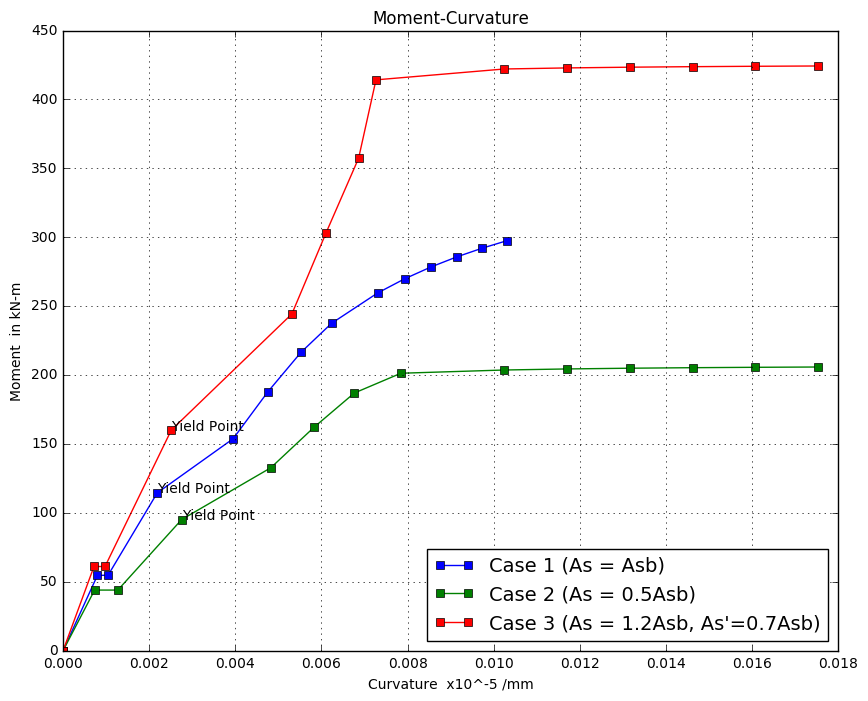

### I. Problem:

------

Moment-Curvature relationship curve of a reinforced concrete beam of different cases with parameters as follows:

**General Cases**

| Cases  | As       | As'      |
| ------ | -------- | -------- |
| Case 1 | A~sb~    | 0        |
| Case 2 | 0.5A~sb~ | 0        |
| Case 3 | A~sb~    | 0.5A~sb~ |

**Beam Properties**

| Property                        | Value    | Unit |
| ------------------------------- | -------- | ---- |
| f'c                             | 21       | MPa  |
| fy                              | 275      | MPa  |
| Es                              | 200,000  | MPa  |
| Ec =  (4,700$ \sqrt{f'c} $)     | 21538.10 | MPa  |
| β~1~                            | 0.85     |      |
| η = Es / Ec                     | 9.28     |      |
| b (beam width)                  | 300      | mm   |
| h (beam height)                 | 450      | mm   |
| d (effective depth)             | 400      | mm   |
| d' (compression steel location) | 50       | mm   |


### II. Solutions / Methodology

------

As a general solution to the problem, analysis as doubly reinforced beam is applied to address all the cases (singly or doubly reinforced). The following are the steps used:

1. Compute for the balanced steel at tension.

   $ Asb = 4,539.92  mm^2 $

2. Steel area is assigned to both tension and compression side as indicated in the general cases.

3. For the 3 stages of the behavior of the beam:

   #### Stage 1 : Cracking point of concrete in tension

   1. Neutral axis location (kd) from the compression fiber of concrete is calculated by transforming area of steel to area of concrete using the modular ratio $\eta$:

      ##### a. Uncrack section (Case 1 : Doubly Reinforced)

      | Particulars                                                  | Calculated Values  |
      | ------------------------------------------------------------ | ------------------ |
      | $ As(transformed) = (\eta - 1) As $                          | 37,617.24 $ mm^2 $ |
      | $ As'(transformed) = (\eta - 1) As' $                        | 18,808.62 $ mm^2 $ |
      | By taking moment of areas of concrete and steel to topmost fiber: |                    |
      | $ kd $                                                       | 242.19 $mm$        |
      | $I~c~$                                                       | $3.949x10^9 mm^4$  |
      |                                                              |                    |
      |                                                              |                    |
      |                                                              |                    |

      For compression, $ As'(transformed) = (\eta -  1)As' $


```python
# Imports
from sympy import *
import math
import matplotlib.pyplot as plt

# Define parameters
b = 300                             # Beam width
h = 450                             # Beam height
clearance = 50                      # Clearance from tension steel to bottom of concrete
d = h - clearance                   # d - Effective depth
d_prime = 50                        # d' - Distance from compression steel to concrete compression fiber
fcprime = 21                        # f'c - Concrete compressive strength
fy = 275                            # fy - Steel tensile strength
fr = 0.7 * math.sqrt(fcprime)       # Modulus of fructure
Es = 200000                         # Modulus of elasticity of steel
Ec = 4700 * math.sqrt(fcprime)      # Modulus of elasticity of concrete
β1 = 0.85                           # Beta
η = Es / Ec                         # Modular ratio

# As balance
ρb = (0.85 * fcprime * β1 * 600) / (fy * (600 + fy)) # Balance concret-steel ratio
Asb = ρb * b * d                    # As balance

# Cases
As = [Asb, 0.5*Asb, Asb]       # Tension reinforcements
AsPrime = [0.0, 0.0, 0.5*Asb]      # Compression reinforcements

# Data holders
M = ([], [], [])                    # Array of moments for the 3 cases
ϕ = ([], [], [])                    # Array of curvature for the 3 cases
I = ([], [], [])                    # Array of all computed moment of inertias
kd = ([], [], [])                   # Array of values of neutral axis to compression fiber
fsm = ([], [], [])                  # Array of strains in concrete
yield_pts = []
```


```python
# =========================================
# Utilities
# =========================================
def solveLo(case_no, 𝜆):
    if case_no ==1:
        return 0.85 / 3 * 𝜆 * (3 - 𝜆)
    else:
        return 0.85 * (3*𝜆 - 1) / (3 * 𝜆)
```


```python
# Insert initial values for moment and curvature
for i in range(3):
    M[i].append(0.0)
    ϕ[i].append(0.0)

for i in range(3):
    print('=======================================')
    print('Case No.', i+1)
    print('=======================================')
    # =========================================== #
    # Calculation before cracking                 #
    # =========================================== #
    # Calculate for kd of each case
    At = b * h                                          # Concrete alone
    At += (η-1) * As[i]                                 # Concrete plus transformed tension steel
    At += (η-1) * AsPrime[i]                            # Plus transformed compression steel
    Ma = (b * h) * (h / 2)                              # Moment of area of concrete to compression fiber
    Ma += (η-1) * As[i] * d                             # Moment of tension reinf. to compression fiber
    Ma += (η-1) * AsPrime[i] * d_prime                  # Moment of compression reinf. to compression fiber
    kdCalculated = Ma / At
    kd[i].append(kdCalculated)                          # Insert to list of kd

    # Calculate for moment of inertia of each case
    Ic = (b * kdCalculated**3 / 12) + (b * kdCalculated * (kdCalculated / 2)**2)
    Ic += (b * (h - kdCalculated)**3 / 12) + (b * (h - kdCalculated) * ((h - kdCalculated) / 2)**2)
    Ic += (η-1) * As[i] * (d - kdCalculated)**2
    Ic += (η-1) * AsPrime[i] * (kdCalculated - d_prime)**2
    I[i].append(Ic)                                     # Insert to list of I
    
    # Calculate the cracking moment
    Mcr = fr* Ic / (h - kdCalculated)                   # Cracking moment
    M[i].append(Mcr)                                    # Insert to list of M
    
    # Calculate the curvature
    ϕc = fr / (Ec * (h - kdCalculated))                 # Curvature right before cracking
    ϕ[i].append(ϕc)                                     # Insert to list of ϕ
    print('Mcr = ', round(Mcr / 1000**2, 2), 'ϕc = ', ϕc, 'kd = ', kdCalculated)
    
    # =========================================== #
    # Calculation after cracking                  #
    # =========================================== #
    # Finding the neutral axis using equilibrium of moment of areas
    # b(kd)(kd/2) + (n-1)As'(kd-d') = nAs(d-kd)
    # -- solve the quadratic equation
    qa = b
    qb = 2 * ((η-1) * AsPrime[i] + η * As[i])
    qc = -2 * ((η-1) * AsPrime[i] * d_prime + η * As[i] * d)
    qd = (qb**2) - (4 * qa * qc)                        # Discriminant
    kdCalculated = (-1 * qb + math.sqrt(qd)) / (2 * qa) # Neutral axis after cracking
    kd[i].append(kdCalculated)
    
    # Calculate moment of inertia
    Ic = (b * kdCalculated**3 / 12) + (b * kdCalculated * (kdCalculated / 2)**2)
    Ic += (η) * As[i] * (d - kdCalculated)**2
    Ic += (η-1) * AsPrime[i] * (kdCalculated - d_prime)**2
    I[i].append(Ic)
    
    # Calculate the curvature
    ϕc = M[i][1] / (Ec * Ic)                            # Curvature right after cracking
    
    M[i].append(Mcr)
    ϕ[i].append(ϕc)
    print('Mcr = ', round(Mcr / 1000**2, 2), 'ϕc = ', ϕc, 'kd = ', kdCalculated, "After cracking...")
    
    # =========================================== #
    # Calculation at yield point                  #
    # =========================================== #
    fc = 0.5 * fcprime
    ⲉc = fc / Ec
    
    qa = 0.5 * fc * b
    qb = (Es * ⲉc) * (AsPrime[i] + As[i])
    qc = -(Es * ⲉc) * (AsPrime[i] * d_prime + As[i] * d)
    qd = (qb**2) - (4 * qa * qc)           # Discriminant
    kdCalculated = (-1 * qb + math.sqrt(qd)) / (2 * qa)

    fs = (Es * ⲉc) * (d - kdCalculated) / kdCalculated
    fsPrime = Es * ⲉc / kdCalculated * (kdCalculated - d_prime)
    if fs > fy:
        fs = fy

    if fsPrime > fy:
        fsPrime = fys
            
    Mc = 0.5 * fc * b * kdCalculated * (d - kdCalculated / 3) +\
                AsPrime[i] * fsPrime * (d - d_prime)
    ϕc = ⲉc / kdCalculated
    
    M[i].append(Mc)
    ϕ[i].append(ϕc)
    print('Myield = ', round(Mc / 1000**2, 2), 'ϕc = ', ϕc, 'ⲉc = ', ⲉc, 'kd = ', kdCalculated)
    
    yield_pts.append((ϕc*1000, Mc / 1000**2))
    
    # =========================================== #
    # Calculation at inelastic behaviour          #
    # =========================================== #
    # Calculate for ⲉo
    ⲉo = 2 * 0.85 * fcprime / Ec
    
    # Iterator increment
    iterator_increment = 0.0002
    
    # For 0 < ⲉc < ⲉo
    ⲉc = 0.5 * ⲉo                                          # My setting for starting strain iteration
    print('For 0 < ⲉc < ⲉo')
    # For case 0 < ⲉc < ⲉo
    while (ⲉc + iterator_increment) <= ⲉo:
        ⲉc = ⲉc + iterator_increment
        𝜆o = ⲉc / ⲉo
        k2 = 1 / 4 * (4 - 𝜆o) / (3 - 𝜆o)
        Lo = solveLo(1, 𝜆o)
        fc = 0.85 * fcprime * (2 * 𝜆o - 𝜆o**2)
        kdCalculated = (As[i] - AsPrime[i]) * fy / (Lo * fc * b)
        fs = (Es * ⲉc) * (d - kdCalculated) / kdCalculated
        fsPrime = Es * ⲉc / kdCalculated * (kdCalculated - d_prime)
        
        if fs >= fy:                                    # Tension steel yields
            # Solve for the stress in compression steel
            if fsPrime < fy:                           
                # Compression steel does not yields
                qa = Lo * fc * b
                qb = (Es * ⲉc) * AsPrime[i] - As[i] * fy
                qc = -(Es * ⲉc) * AsPrime[i] * d_prime
                qd = (qb**2) - (4 * qa * qc)           # Discriminant
                kdCalculated = (-1 * qb + math.sqrt(qd)) / (2 * qa)
                fs = (Es * ⲉc) * (d - kdCalculated) / kdCalculated
                fsPrime = Es * ⲉc / kdCalculated * (kdCalculated - d_prime)
                print('Tension steel yields but compression steel did not.')
            else:
                # fs and fs' > fy
                kdCalculated = (As[i] - AsPrime[i]) * fy / (Lo * fc * b)
                fs = fy
                fsPrime = fy
                print('Both tension and compression steel yields.')
        else:
            print('Tension steel did not yield.')
            qa = Lo * fc * b
            qb = AsPrime[i] * fy + As[i] * Es * ⲉc
            qc = -As[i] * Es * ⲉc * d
            qd = (qb**2) - (4 * qa * qc)           # Discriminant
            kdCalculated = (-1 * qb + math.sqrt(qd)) / (2 * qa)
            fs = (Es * ⲉc) * (d - kdCalculated) / kdCalculated
            fsPrime = Es * ⲉc / kdCalculated * (kdCalculated - d_prime)
        
        Mc = Lo * fc * b * kdCalculated * (d - k2 * kdCalculated) +\
                AsPrime[i] * fsPrime * (d - d_prime)
        ϕc = ⲉc / kdCalculated
        
        M[i].append(Mc)
        ϕ[i].append(ϕc)
        
        print('Mc = ', round(Mc / 1000**2, 2), 'ϕc = ', round(ϕc, 8), 'ⲉc = ', round(ⲉc, 5), 'kd = ', round(kdCalculated, 0), 'fc = ', fc)
    
    print("For ⲉo < ⲉc < ⲉcu")
    # For case ⲉo < ⲉc < ⲉcu
    ⲉc = ⲉo + 0.0001
    while (ⲉc + iterator_increment) <= 0.003:
        ⲉc = ⲉc + iterator_increment
        ζc = ⲉo / ⲉc
        𝜆o = 1 / ζc
        Lo = solveLo(2, 𝜆o)
        k2 = (6 * 𝜆o**2 - 4 * 𝜆o + 1) / (4 * 𝜆o * (3 * 𝜆o - 1))
        fc = 0.85 * fcprime
        kdCalculated = (As[i] - AsPrime[i]) * fy / (Lo * fc * b)
        fs = (Es * ⲉc) * (d - kdCalculated) / kdCalculated
        fsPrime = Es * ⲉc / kdCalculated * (kdCalculated - d_prime)
        
        if fs >= fy:                                    # Tension steel yields
            # Solve for the stress in compression steel
            if fsPrime < fy:                           
                # Compression steel does not yields
                qa = Lo * fc * b
                qb = (Es * ⲉc) * AsPrime[i] - As[i] * fy
                qc = -(Es * ⲉc) * AsPrime[i] * d_prime
                qd = (qb**2) - (4 * qa * qc)           # Discriminant
                kdCalculated = (-1 * qb + math.sqrt(qd)) / (2 * qa)
                fs = (Es * ⲉc) * (d - kdCalculated) / kdCalculated
                fsPrime = Es * ⲉc / kdCalculated * (kdCalculated - d_prime)
                print('Tension steel yields but compression steel did not.')
            else:
                # fs and fs' > fy
                kdCalculated = (As[i] - AsPrime[i]) * fy / (Lo * fc * b)
                fs = fy
                fsPrime = fy
                print('Both tension and compression steel yields.')
        else:
            print('Tension steel did not yield.')
            qa = Lo * fc * b
            qb = AsPrime[i] * fy + As[i] * Es * ⲉc
            qc = -As[i] * Es * ⲉc * d
            qd = (qb**2) - (4 * qa * qc)           # Discriminant
            kdCalculated = (-1 * qb + math.sqrt(qd)) / (2 * qa)
            fs = (Es * ⲉc) * (d - kdCalculated) / kdCalculated
            fsPrime = Es * ⲉc / kdCalculated * (kdCalculated - d_prime)
            
        Mc = Lo * fc * b * kdCalculated * (d - k2 * kdCalculated) +\
                AsPrime[i] * fsPrime * (d - d_prime)
        ϕc = ⲉc / kdCalculated
        
        print('Mc = ', round(Mc / 1000**2, 2), 'ϕc = ', round(ϕc, 8), 'ⲉc = ', round(ⲉc, 5), 'kd = ', round(kdCalculated, 0), 'fc = ', fc)
        ϕ[i].append(ϕc)
        M[i].append(Mc)
```

    =======================================
    Case No. 1
    =======================================
    Mcr =  54.57 ϕc =  7.970318780711861e-07 kd =  263.13649515099587
    Mcr =  54.57 ϕc =  1.0428634969669626e-06 kd =  223.02262969808856 After cracking...
    Myield =  114.39 ϕc =  2.1859129421746513e-06 ⲉc =  0.0004875080526548766 kd =  223.0226296980886
    For 0 < ⲉc < ⲉo
    Tension steel did not yield.
    Mc =  153.69 ϕc =  3.95e-06 ⲉc =  0.00103 kd =  261.0 fc =  15.281428223688067
    Tension steel did not yield.
    Mc =  187.86 ϕc =  4.76e-06 ⲉc =  0.00123 kd =  258.0 fc =  16.655591741493783
    Tension steel did not yield.
    Mc =  216.42 ϕc =  5.52e-06 ⲉc =  0.00143 kd =  259.0 fc =  17.509990553417143
    Tension steel did not yield.
    Mc =  237.47 ϕc =  6.23e-06 ⲉc =  0.00163 kd =  261.0 fc =  17.844624659458155
    For ⲉo < ⲉc < ⲉcu
    Tension steel did not yield.
    Mc =  259.5 ϕc =  7.3e-06 ⲉc =  0.00196 kd =  268.0 fc =  17.849999999999998
    Tension steel did not yield.
    Mc =  269.74 ϕc =  7.93e-06 ⲉc =  0.00216 kd =  272.0 fc =  17.849999999999998
    Tension steel did not yield.
    Mc =  278.35 ϕc =  8.54e-06 ⲉc =  0.00236 kd =  276.0 fc =  17.849999999999998
    Tension steel did not yield.
    Mc =  285.68 ϕc =  9.14e-06 ⲉc =  0.00256 kd =  280.0 fc =  17.849999999999998
    Tension steel did not yield.
    Mc =  292.0 ϕc =  9.73e-06 ⲉc =  0.00276 kd =  283.0 fc =  17.849999999999998
    Tension steel did not yield.
    Mc =  297.51 ϕc =  1.032e-05 ⲉc =  0.00296 kd =  287.0 fc =  17.849999999999998
    =======================================
    Case No. 2
    =======================================
    Mcr =  43.86 ϕc =  7.315136942596765e-07 kd =  246.40002452244482
    Mcr =  43.86 ϕc =  1.27052110091158e-06 kd =  177.01582310560858 After cracking...
    Myield =  95.07 ϕc =  2.7540365832947417e-06 ⲉc =  0.0004875080526548766 kd =  177.01582310560858
    For 0 < ⲉc < ⲉo
    Tension steel did not yield.
    Mc =  132.65 ϕc =  4.82e-06 ⲉc =  0.00103 kd =  213.0 fc =  15.281428223688067
    Tension steel did not yield.
    Mc =  161.97 ϕc =  5.83e-06 ⲉc =  0.00123 kd =  211.0 fc =  16.655591741493783
    Tension steel did not yield.
    Mc =  186.87 ϕc =  6.76e-06 ⲉc =  0.00143 kd =  211.0 fc =  17.509990553417143
    Tension steel yields but compression steel did not.
    Mc =  201.24 ϕc =  7.85e-06 ⲉc =  0.00163 kd =  208.0 fc =  17.844624659458155
    For ⲉo < ⲉc < ⲉcu
    Both tension and compression steel yields.
    Mc =  203.58 ϕc =  1.024e-05 ⲉc =  0.00196 kd =  191.0 fc =  17.849999999999998
    Both tension and compression steel yields.
    Mc =  204.35 ϕc =  1.17e-05 ⲉc =  0.00216 kd =  184.0 fc =  17.849999999999998
    Both tension and compression steel yields.
    Mc =  204.89 ϕc =  1.316e-05 ⲉc =  0.00236 kd =  179.0 fc =  17.849999999999998
    Both tension and compression steel yields.
    Mc =  205.27 ϕc =  1.462e-05 ⲉc =  0.00256 kd =  175.0 fc =  17.849999999999998
    Both tension and compression steel yields.
    Mc =  205.55 ϕc =  1.608e-05 ⲉc =  0.00276 kd =  172.0 fc =  17.849999999999998
    Both tension and compression steel yields.
    Mc =  205.76 ϕc =  1.754e-05 ⲉc =  0.00296 kd =  169.0 fc =  17.849999999999998
    =======================================
    Case No. 3
    =======================================
    Mcr =  60.97 ϕc =  7.167101269032306e-07 kd =  242.19468984442693
    Mcr =  60.97 ϕc =  9.733433018711496e-07 kd =  196.764121236301 After cracking...
    Myield =  159.98 ϕc =  2.5125377830969175e-06 ⲉc =  0.0004875080526548766 kd =  194.0301379484058
    For 0 < ⲉc < ⲉo
    Tension steel did not yield.
    Mc =  244.28 ϕc =  5.31e-06 ⲉc =  0.00103 kd =  194.0 fc =  15.281428223688067
    Tension steel did not yield.
    Mc =  302.97 ϕc =  6.1e-06 ⲉc =  0.00123 kd =  201.0 fc =  16.655591741493783
    Tension steel did not yield.
    Mc =  357.3 ϕc =  6.86e-06 ⲉc =  0.00143 kd =  208.0 fc =  17.509990553417143
    Tension steel yields but compression steel did not.
    Mc =  414.18 ϕc =  7.27e-06 ⲉc =  0.00163 kd =  224.0 fc =  17.844624659458155
    For ⲉo < ⲉc < ⲉcu
    Both tension and compression steel yields.
    Mc =  422.07 ϕc =  1.024e-05 ⲉc =  0.00196 kd =  191.0 fc =  17.849999999999998
    Both tension and compression steel yields.
    Mc =  422.84 ϕc =  1.17e-05 ⲉc =  0.00216 kd =  184.0 fc =  17.849999999999998
    Both tension and compression steel yields.
    Mc =  423.37 ϕc =  1.316e-05 ⲉc =  0.00236 kd =  179.0 fc =  17.849999999999998
    Both tension and compression steel yields.
    Mc =  423.75 ϕc =  1.462e-05 ⲉc =  0.00256 kd =  175.0 fc =  17.849999999999998
    Both tension and compression steel yields.
    Mc =  424.03 ϕc =  1.608e-05 ⲉc =  0.00276 kd =  172.0 fc =  17.849999999999998
    Both tension and compression steel yields.
    Mc =  424.25 ϕc =  1.754e-05 ⲉc =  0.00296 kd =  169.0 fc =  17.849999999999998


```python
# Convert the values of data to smaller figures
ϕ_converted = ([], [], [])
M_converted = ([], [], [])
for i in range(3):
    for curvature in ϕ[i]:
        ϕ_converted[i].append(curvature * 1000)
    for moment in M[i]:
        M_converted[i].append(moment / 1000**2)
        
# Plot the curves
plt.figure(figsize=(10,8))
plt.title("Moment-Curvature")
plt.xlabel('Curvature  x10^-5 /mm')
plt.ylabel('Moment  in kN-m')
plt.grid()

for yp in yield_pts:
    plt.text(yp[0], yp[1], 'Yield Point')

# Plot the converted values
case1, = plt.plot(ϕ_converted[0], M_converted[0], marker='s', label='Case 1 (As = Asb)')
case2, = plt.plot(ϕ_converted[1], M_converted[1], marker='s', label='Case 2 (As = 0.5Asb)')
case3, = plt.plot(ϕ_converted[2], M_converted[2], marker='s', label='Case 3 (As = 1.2Asb, As\'=0.7Asb)')
plt.legend(handles=[case1, case2, case3], loc='best', fontsize=14)
plt.show()
```




