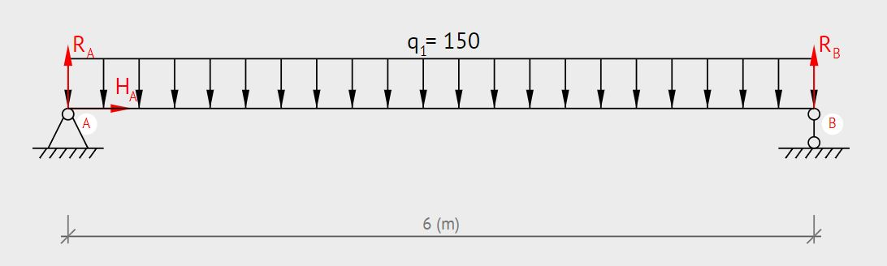
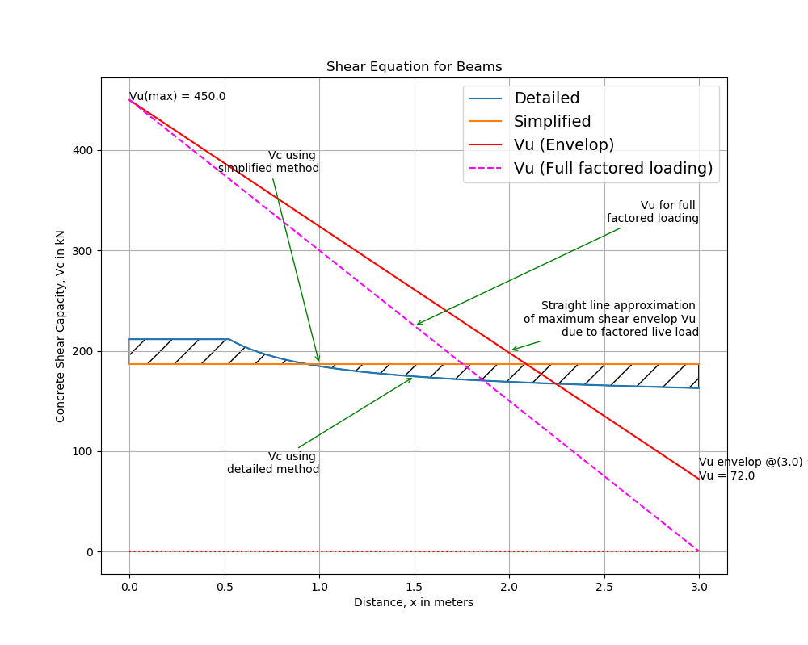
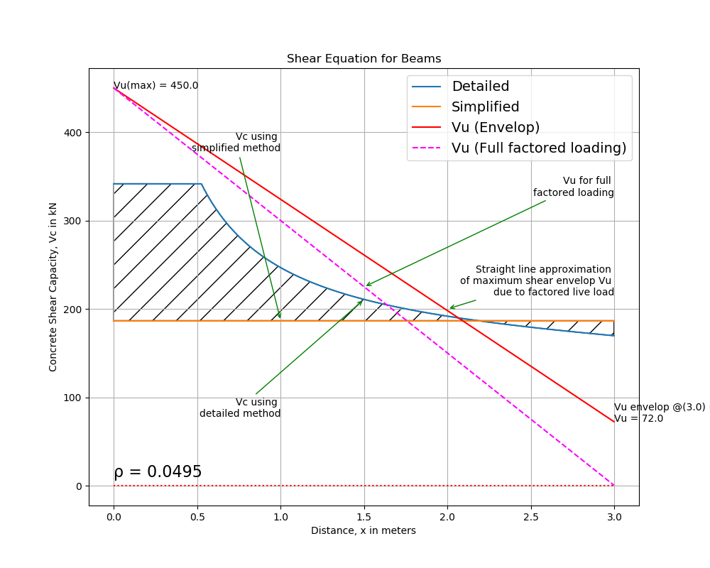
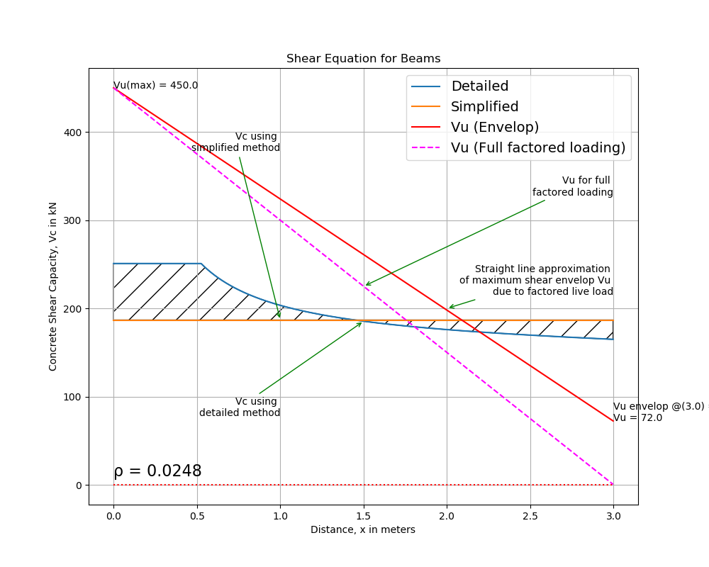
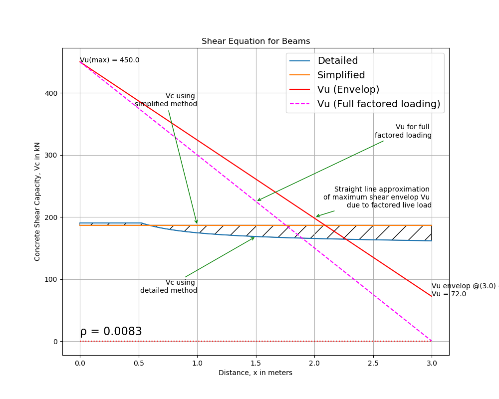
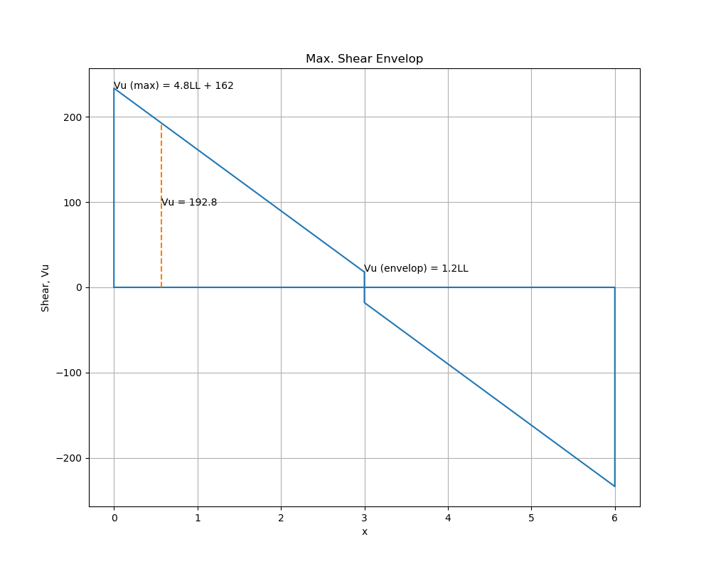

#### **I**. Problem: Corbel

A column bracket shown below is to be designed to carry the end reaction from a long span pre-cast girder. Vertical reactions from service dead and live loads are $25 kips$ and $51 kips$ respectively applied $5.5 in.$ from the column face. A steel bearing plate will be provided for the girder, which will rest directly on a $5x3x3/8 in.$ steel angle at the outer corner of the bracket. Bracket reinforcement will include main steel As welded to the underside of the steel angle, closed hoop stirrups having total area Ah distributed appropriately through the bracket depth and framing bars in a vertical plane near the outer face. Select appropriate concrete dimensions and design and detail all reinforcement. Material strengths are $fc’=3000psi$ and $fy=40,000psi$.


#### I. Problem 2: Shear

1. Plot the shear equation for beams (Detailed and Simplified) considering a simple beam problem.

2. Compare the two plots according to its area of influence. State which is more conservative and economical.

3. Compute the maximum ultimate load the beam can resist for shear considering 
   - minimum shear reinforcement
   - maximum spacing


#### II. Solution:

1. Simplified Method
   $$
   V_c = \dfrac{1}{6} \sqrt{f'c} b_w d
   $$

2. Detailed Method
   $$
   V_c = \dfrac{1}{7} \{\sqrt{f'c} + 120\rho_w \dfrac{V_u d}{M_u}\}b_wd
   $$


Assuming the beam is given below:

| Property | Value | Unit   |
| -------- | ----- | ------ |
| $b$      | 375   | $mm$   |
| $d$      | 570   | $mm$   |
| $As$     |       | $mm^2$ |
| $f'c$    | 27.5  | $MPa$  |
| $fy$     | 275   | $MPa$  |

<figure><figcaption>Figure 2.1. Beam Sample</figcaption></figure>


##### Using python for calculations:

1. Plotting the equations:

```python
# ----------------------------------------------
# Problem definition
# ----------------------------------------------
fcPrime = 27.5
fy = 275
b = 375                     # Web
d = 570                     # Effective depth
DL = 45                     # kN/m
LL = 60                     # kN/m
L = 6000                    # mm
a = L / 2                   # Half of beam
As = 3000                   # 4 - 20mm dia.
p = As / (b * d)            # rho, steel-concrete ratio
no_of_increment = 1000
```

```python
# ----------------------------------------------
# Constants / Factors
# ----------------------------------------------
dl_factor = 1.2             # Deadload factor
ll_factor = 1.6             # Liveload factor
```

```python
# ----------------------------------------------
# Calculations
# ----------------------------------------------
# 1. Vc using simplified method
vc_simplified = 1 / 6 * math.sqrt(fcPrime) * b * d

# 2. Vc using more detailed formula
# 2.1. Total Factored load
wu = dl_factor * DL + ll_factor * LL

# 2.2. Calculate reaction at left support (A)
r_a = wu * L / 2

# 2.3. For the shear envelop
r_be = ll_factor * LL * a * (a / 2) / L

# 2.4. Analyze half of the beam
# Discretize half of beam by 1000 division
increment = a / no_of_increment

# 2.4.1. Variables for calculated values
xs = []                     # Values of x at discrete points
simp = []                   # Values of Vc (simplified) at every point
vcs = []                    # Values of Vc (detailed) at every point
vus = []                    # Values of Vu at every point (envelope)
beam = []                   # Ordinate of beam element at every point
vus_full = []               # Values of Vu (full factored loading)

# Initialize at x = 0
x = 0

for i in range(1, no_of_increment+1):
    vu_full = r_a * (a - x) / a
    vu = r_be + ((r_a - r_be) / a) * (a - x)
    mu = (r_a + vu) / 2 * x

    # Fraction Vu.d/Mu should not exceed unity
    if (vu * d > mu):
        mu = vu * d

    vc = (1.0 / 7.0) * (math.sqrt(fcPrime) + 120 * p * (vu * d / mu)) * b * d

    xs.append(x / 1000)
    vcs.append(vc / 1000)
    vus.append(vu / 1000)
    simp.append(vc_simplified / 1000)
    beam.append(0)
    vus_full.append(vu_full / 1000)

    x = increment * i
```

Plot of the equations:
<figure><figcaption>Figure 2.2. Plot of Equations (Simplified vs. Detailed)</figcaption></figure>

2. Comparison of the equations:

From the figure above, it can be seen that the detailed equation is more conservative on the part of less shear but in the portion of maximum shear stress, the simplified method is conservative. This is based on $\rho_w$ of about 0.014. Looking further to investigate, various plots are made with varying values of $\rho$ as shown below.

|                                                              |                                                              |
| ------------------------------------------------------------ | ------------------------------------------------------------ |
| Figure 2.3. $\rho_w$ is equal to $\rho_{bal}$ | Figure 2.4. $\rho_w$ is equal to $0.5\cdot \rho_{bal}$ |
| Figure 2.5. $\rho_w$ is equal to $\dfrac{1}{3}\rho_{bal}$ |                                                              |

Judging from the 3 figures above, ratio of steel to concrete $\rho$ plays a significant role in determining the concrete shear strength $V_c$. The larger the steel reinforcement, the more the detailed method becomes economical and the simplified method becomes more conservative.

But to summarize, generally, the detailed method is more economical but less conservative, maybe it's the reason the ACI-ASCE Committee has recommended against further use of it.

3. **Maximum Ultimate Load for Shear**

   Assuming that we use 2 10mm-$\phi$ vertical stirrups.
   $$
   A_v = 157 mm^2
   $$


   **a. Minimum shear reinforcement**
$$
   A_v(min) = 0.062\sqrt{f'c}\dfrac{b_w s}{fy}
$$
   This must be greater than
$$
   A_v(min) = \dfrac{0.35b_ws}{fy}
$$


   using $A_v(min) = 157mm^2$, $s = 350mm$

   checking $\dfrac{0.35 b_w s}{fy} = 167$ > $A_v$, recalculate now for $s$ using equation (5).

   $s = 328$, use $s = 320mm$

   Now, for the shear strength of stirrups,
$$
   V_s = \dfrac{A_vf_{yt}d}{s}
$$
   shall not be taken greater than
$$
   V_s = 0.66\sqrt{f'c}b_wd
$$
   Using equation (6), $V_s = 70.31kN$

   Using equation (7), $V_s = 739.80kN$, therefore, adopt the $70.31kN$.

   For the shear strength of concrete, using the simplified method,
$$
   V_c = 186.80kN
$$

$$
   \dfrac{V_u}{\phi} = V_c + V_s
$$

   From ACI 318-11 Table 5-2: Strength Reduction Factors $\phi$ in the Strength Design Method

| Particular                                                   | **$\phi$**       |
| ------------------------------------------------------------ | ---------------- |
| Tension-controlled sections                                  | 0.90             |
| Compression-controlled sections
Members with spiral reinforcement conforming to 10.9.3 
Other reinforced members | <br>0.75<br>0.65 |
| Shear and Torsion                                            | 0.75             |
| Bearing on concrete (except for post-tensioned anchorage zones) | 0.65             |
| Post-tensioned anchorage zones                               | 0.85             |
| Struts, ties, nodal zones and shearing areas in strut-and-tie models (Appendix A) | 0.75             |

**using $\phi = 0.75$,**

   $V_u = 192.80kN$, Assuming that the critical section is at distance 570mm from the support,

   and, considering shear envelop while the dead load is fixed at $DL = 45kN/m$, 

****

**Calculating for $LL$, we obtain $LL = 14.96kN/m$, thus**
$$
W_u = 1.2DL + 1.6LL
$$

<div style="display: block; text-align: center; font-size: 1.5em; font-weight: bolder; width: 30%; height: 50px; margin: auto auto; border: 2px solid black;">
W<sub>u</sub> = 77.94kN/m
</div>


   b. Maximum spacing 

For the maximum spacing, 

**try using $s = d / 2$ or $s = 285mm$**

**$V_s = 86.35kN​$**

**then,**

**$V_u = 86.35 + 186.80$**

**$V_u = 273.15kN$**

**By using the process as above, (a), $LL$ is obtained to be $LL = 34.48kN/m$, thus**

<div style="display: block; text-align: center; font-size: 1.5em; font-weight: bolder; width: 30%; height: 50px; margin: auto auto; border: 2px solid black;">
W<sub>u</sub> = 109.17kN/m
</div>